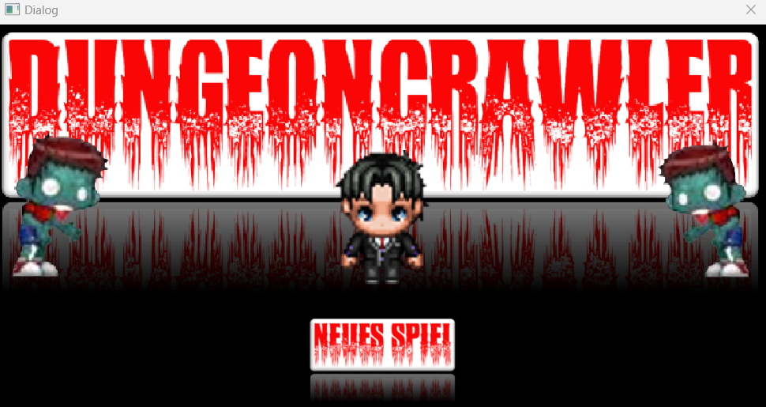
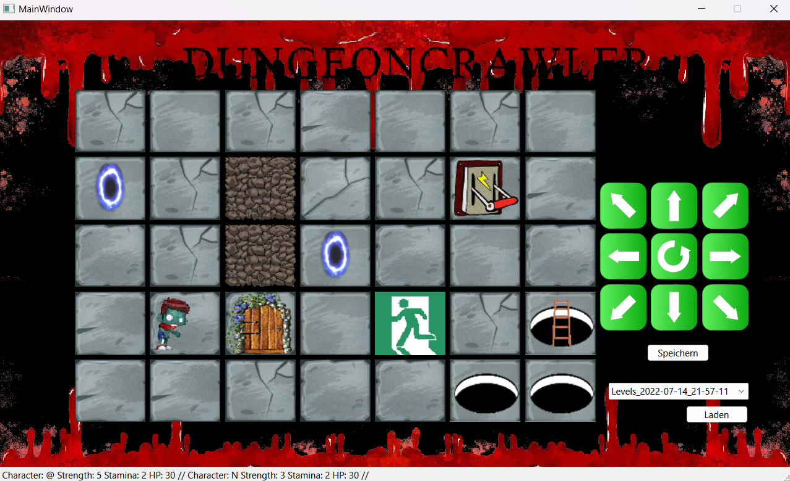
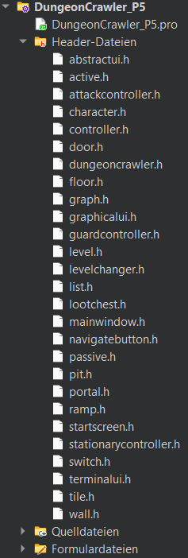
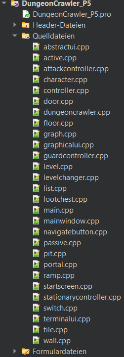
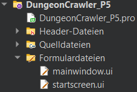
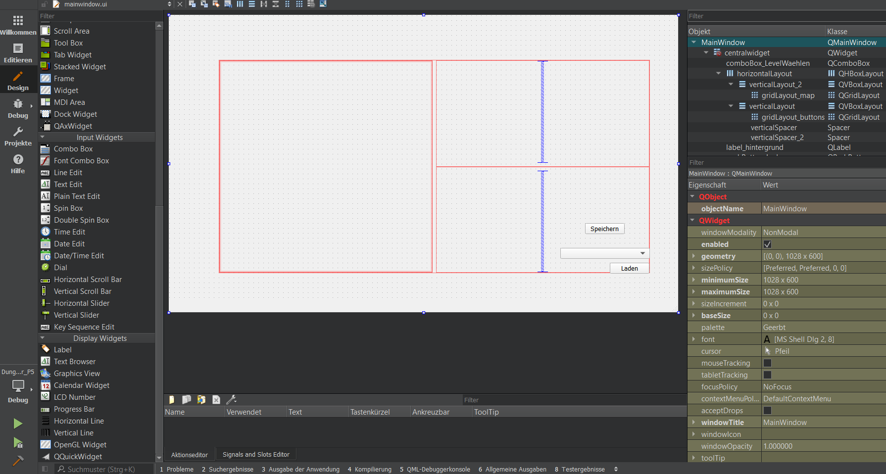
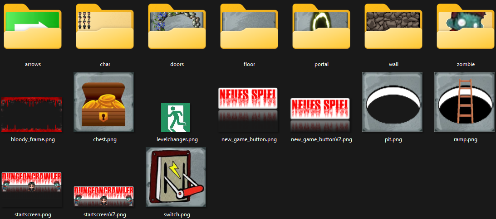

# Dungeon Crawler

- <Badge type="info" text="Jahr: 2022" />
  <Badge type="tip" text="Uni" />

Dungeon Crawler war ein semesterbegleitendes Projekt, in dem ich das Spiel Dungeon Crawler in C++ entwickelt habe. Es war mein erstes größeres Projekt, bei dem ich viele neue Kenntnisse aus dem Modul „Programmieren 2" anwenden konnte – beispielsweise Design Patterns wie das Observer-Pattern.

Im Spiel steuert der Spieler einen Charakter über ein zweidimensionales Spielfeld. Spiele-Level werden dynamisch als .csv-Dateien eingelesen. Auch Charaktere und Verknüpfungen zwischen Leveln sind dynamisch und werden aus einfachen .txt-Dateien gelesen. Spiele konnten gespeichert und geladen werden. NPC-Gegner verfügten über einen Pathfinding-Algorithmus zum Spieler hin. Das Pathfinding funktionierte über Portale hinweg und war levelübergreifend.

## Technologien

- Qt, Qt-GUI
- C++
- CSV

## Level struktur

```shell
levels/
└── example_level/
    ├── linklevelchanger.txt
    ├── level1/
    │   ├── charakter.txt
    │   ├── links.txt
    │   └── map.csv
    └── level2/
        ├── charakter.txt
        ├── links.txt
        └── map.csv
```

linklevelchanger.txt

```txt
Levelchanger:
levelOrdner:level1
link:3,4
levelOrdner:level2
link:0,3
```

charakter.txt

```txt
charakter:
typ:Player
set:0;0
symbol:@
strength:5
stamina:2
controller:0;0;0

charakter:
typ:NPC
set:3;1
symbol:N
strength:3
stamina:2
controller:attack;0;0
```

links.txt

```txt
Portal:
place:1;0
link:2;3
type:0

Portal:
place:2;3
link:1;0
type:0

Switch
place:1;5
link:3;2

```

map.csv

```csv
7;5
.;.;.;.;.;.;.;
O;.;#;.;.;?;.;
.;.;#;O;.;.;.;
.;.;X;.;D;.;~;
.;.;.;.;.;_;_;
```

## Screenshots







QT Designer vom Main Window


Assets

