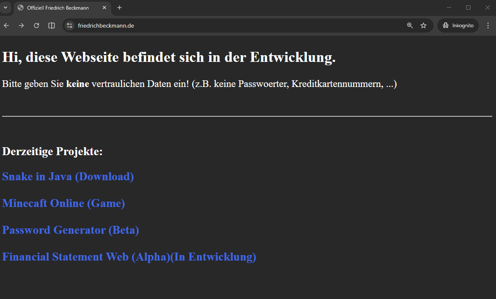
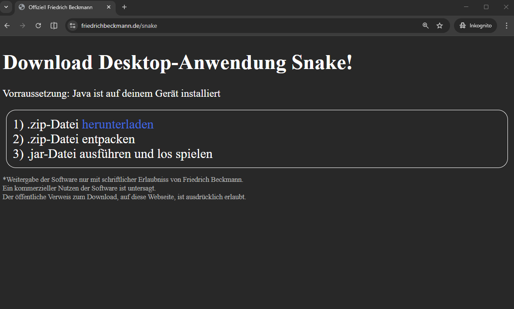
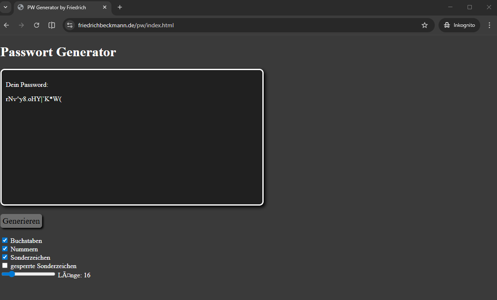
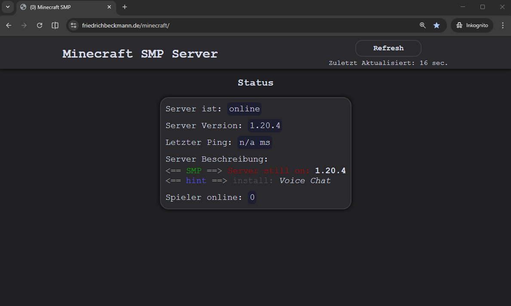
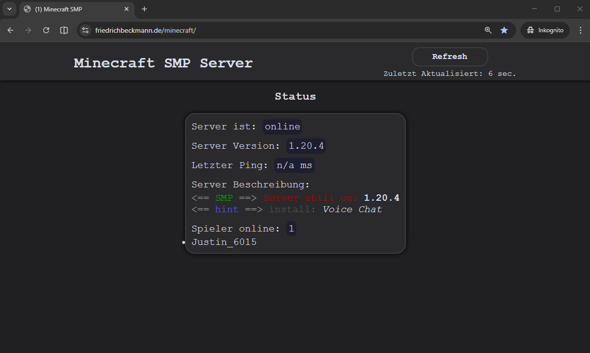
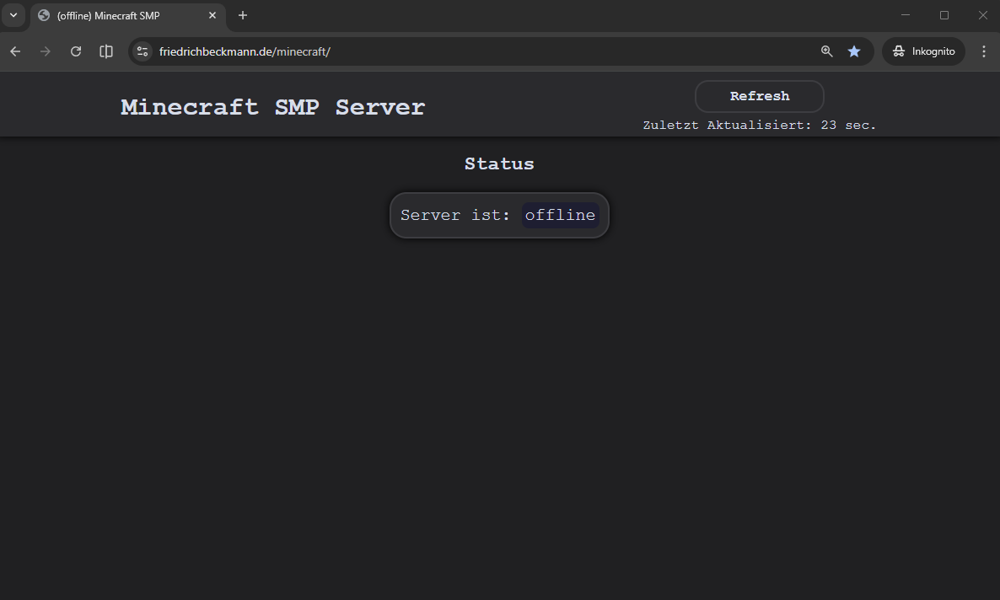

# Erste öffentliche Webseite

Jahr: 2021 bis 2026

## Technologien

- IDE: VSC
- PHP
- HTML, CSS
- Internetinformationsdienste (IIS)-Manager

Screenshot von friedrichbeckmann.de root:

Screenshot von friedrichbeckmann.de/sanke Snake:  
Siehe auch: [Projekt Snake](../snake)

Screenshot von friedrichbeckmann.de/pw Passwort Generator:

## Minecraft Server Monitoring

Meine zweite Version von Minecraft Server Monitoring.  
Im Jahr 2024 komplett neu geschrieben zur Vorbereitung für die Klausur "Einführung in die Webentwicklung".

- HTML, CSS
- PHP: Seitenklassen (Vererbungstechnick)

Screenshot von friedrichbeckmann.de/minecraft Live Monitoring von meinem Minecraft SMP Server:

