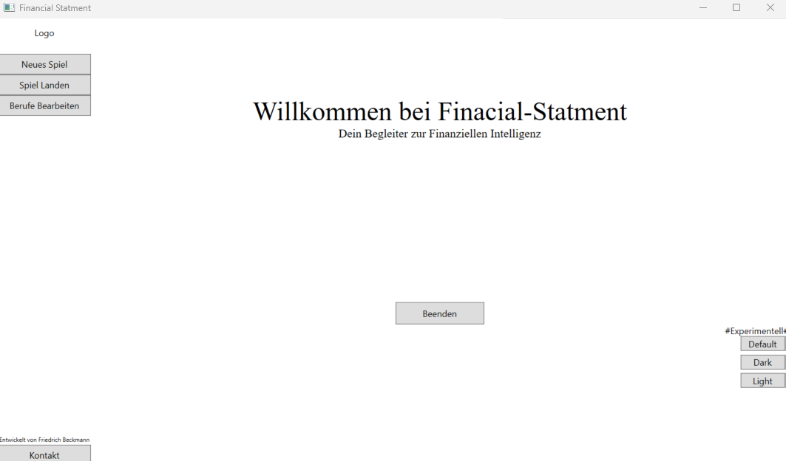
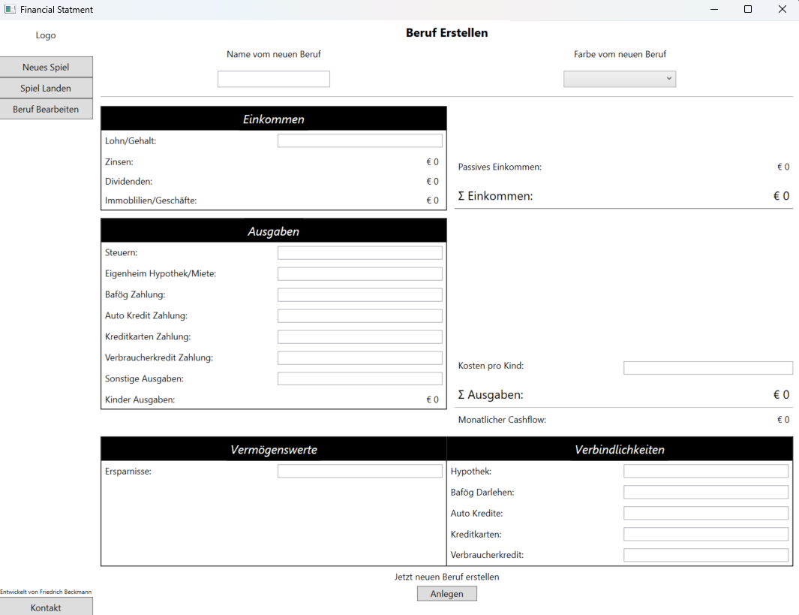
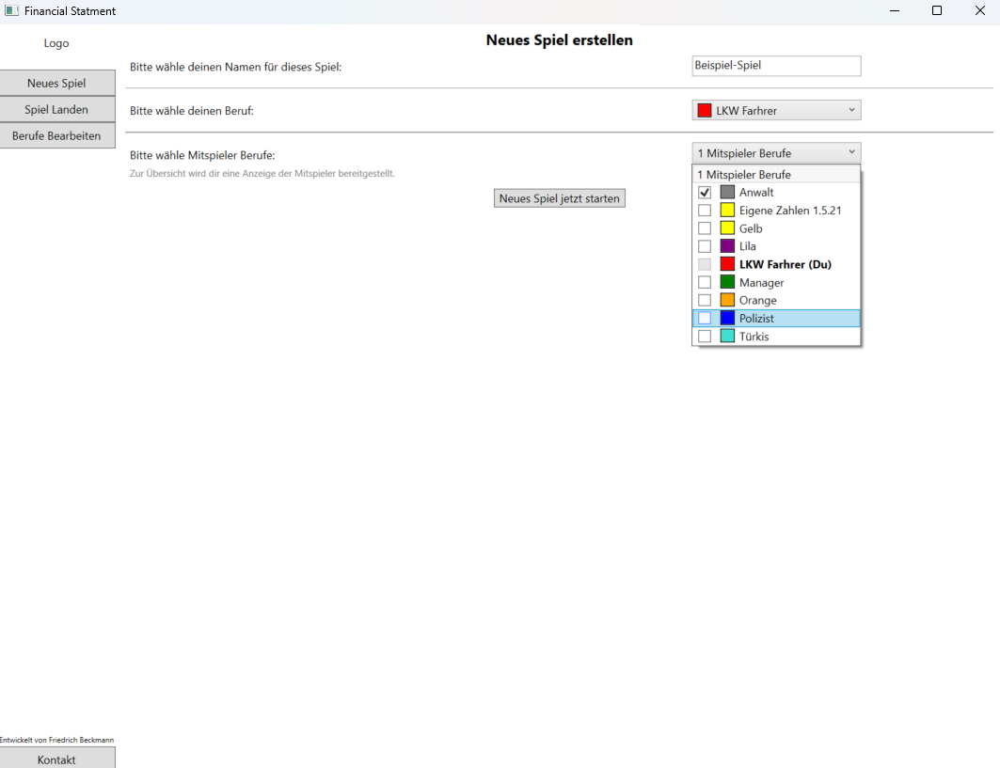
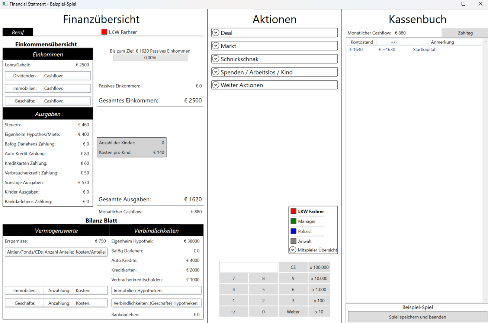
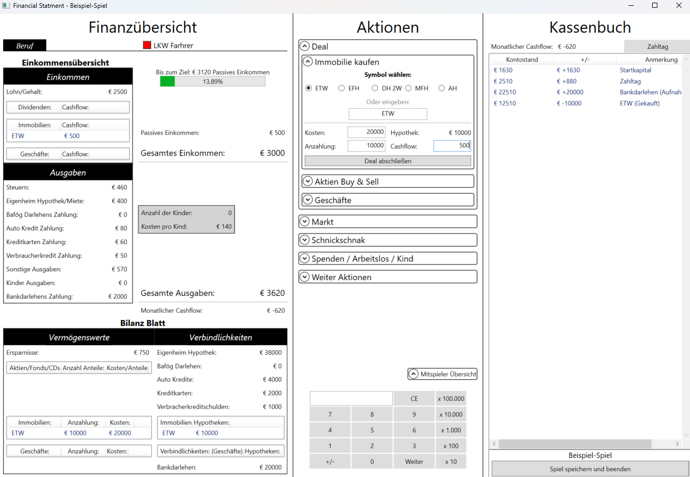

# Financial Statement Desktop

Jahr: 2020

Digitale Lösung für die "Finanzübersicht" vom Brettspiel "Cashflow 101".

- Berufe Editor: Eigene Berufe erstellen.
- Neues Spiel erstellen.
  - Spiel Titel festlegen
  - Eigenen Beruf auswählen
  - Mitspieler Berufe auswählen
- Spiel beenden, und Spiele neu laden.
- Berufe und Spiele werden in eigene Ordner in .txt Dateien in Klartext abgelegt.

## Technologien

- IDE: VS
- C#
- WPF (windows presentation foundation)

## Screenshots

Home

Beruf erstellen

Spiel erstellen

Im Spiel (neues Spiel)

Im Spiel: bisher einmal Bankdarlehn aufgenommen und eine Eigentumswohung (ETW gekauft)

