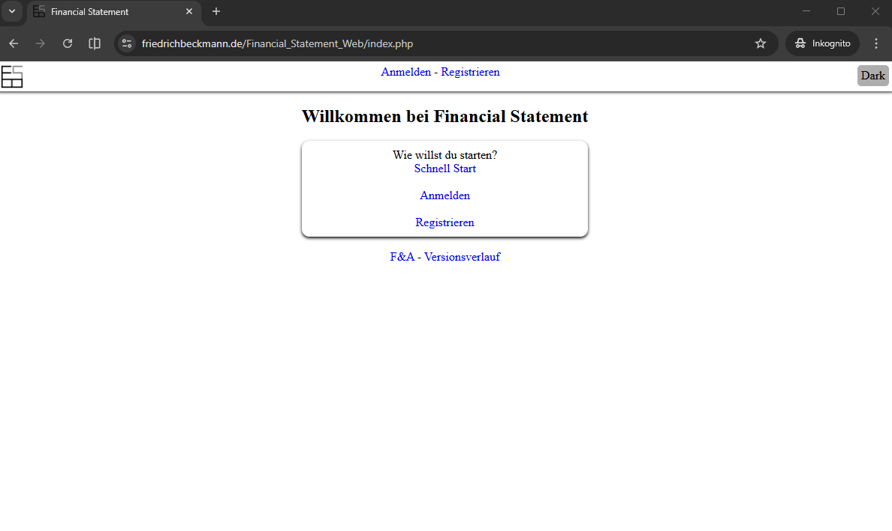
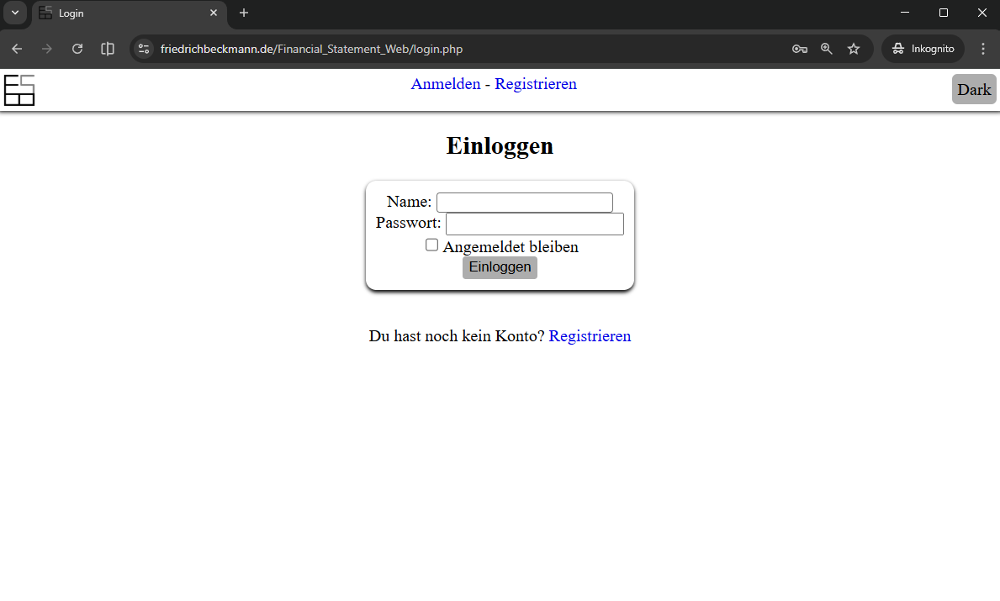
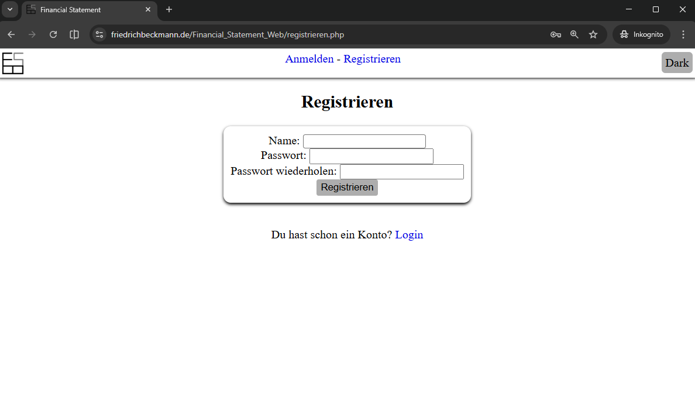
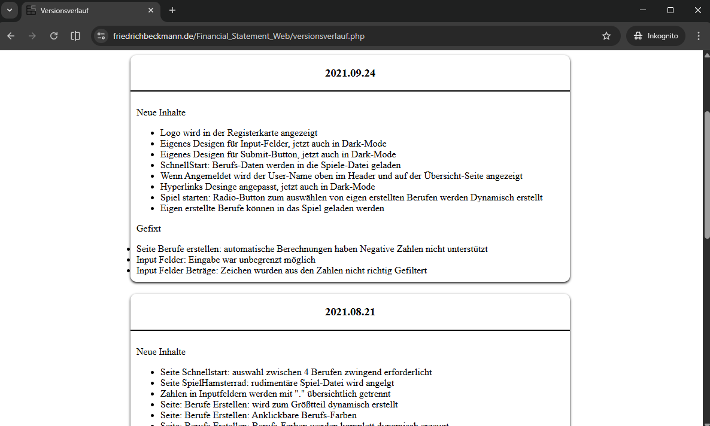

# Financial Statement Web

Jahr: 2021

Digitale Lösung für die "Finanzübersicht" vom Brettspiel "Cashflow 101".

Implementierte Funktionen:

- Registrierung und Login von Scretch mit PHP, JS und MySQL
- 4 Berufe Presets zum schnellen start (ohne Login möglich)
- Eigene Berufe erstellen. (Wird im eigenen Profil gespeichert)

Nie fertig Implementiert.
Siehe stattdessen "Finanzstatus Desktop for Windows with C#" // TODO link here

## Technologien

- IDE: VSC
- PHP
- HTML, CSS
- MySQL

## Screenshots

Home

Anmelden

Registrierung

Changelog

