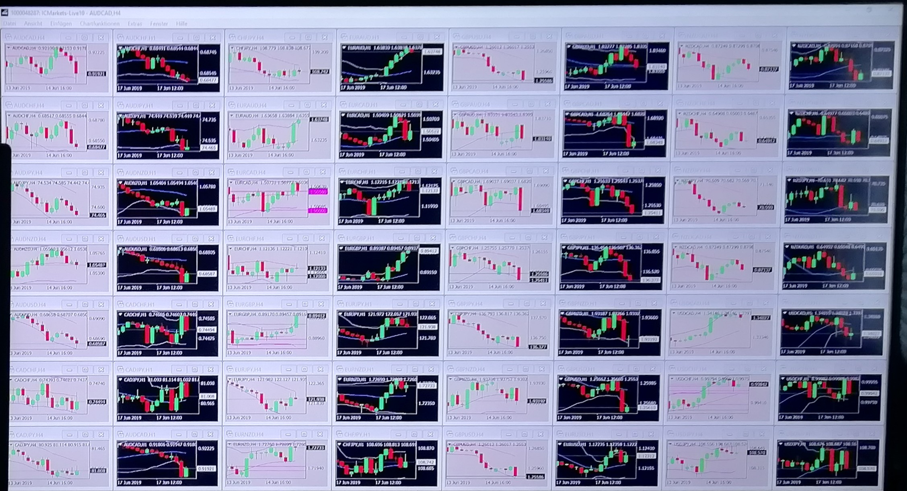

# Forex bots

- <Badge type="info" text="Jahr: 2019 - 2021" />
  <Badge type="tip" text="Privat" />

Entwicklung von Forex (Devisen) Trading Bots.  
Als Programmier Anfänger: Alles in einer Datei (1973 Zeilen Code).  
Viel über Programmieren gelernt durch eigenes testen und lesen von mitgelieferten Bibliotheken.

## Technologien

- MetaTrader
  - mql4 (.mq4)
  - mql5 (.mq5)
  - Backtests mit Integrierter Backtest Software.
  - Forward Tests mit Echtzeit Daten
- Strato Server (Windows Remote Desktop)
- Telegram Benachrichtigung Bot (mit Screenshot und Zusammenfassung des Signals)

Foto von Forex-Bots in 56 verschiedenen Paaren:

Screenshot von einem dokumentierten Entry-Signal in der Research-Phase. Mit Text-Output vom Bot und manuellen Notizen:

## Beispiel: Entry und Close

Eigene Orderverwaltung implementiert (Paper handel im Metatrade entsprachen nicht meinen Anforderungen)

1. Bot findet Entry: Setzt eine virtuelle Position, speichert diesen Screenshot ab, sendet eine Telegram Nachricht mit dem Screenshot und den Eckdaten.
   
2. Bot schließt virtuelle Position und berechnet Gewinn/Verlust. Und speichert diesen Screenshot ab.
   
