# Movie Match

- <Badge type="info" text="Jahr: 2025" />
  <Badge type="tip" text="Uni" />

::: warning
An diesem Projekt haben mehrere Studierende mitgearbeitet. Es war kein Einzelprojekt.
:::

Movie-Match war ein semesterbegleitendes Gruppenprojekt im Modul „Fortgeschrittene Webentwicklung“. Ziel des Projekts war es, eine Webseite zu entwickeln, auf der sich Nutzerinnen und Nutzer wie Freunde oder Familienmitglieder gemeinsam auf einen Film einigen können, zum Beispiel für einen gemeinsamen Filmabend.

Jede Person hat einen eigenen Account. Nutzer können sich gegenseitig über eine Suche finden und einander folgen. Über die Filmsuche mit der TMDB-API können Filme gesucht und in Movie-Match bewertet werden, sowohl mit einer Sternebewertung von 1 bis 5 als auch mit Freitext. Follower können diese Aktivitäten anderer Nutzer sehen.

Außerdem können Nutzer Gruppen anlegen und andere Personen einladen. In den Gruppen gibt es einen Chat, über den sich die Mitglieder austauschen können. Dieser wurde von einem Kommilitonen mit Sockets umgesetzt. Zusätzlich können in einer Gruppe sogenannte Polls erstellt werden. Die Gruppenmitglieder haben dann eine festgelegte Zeit, um abzustimmen. Nach Ablauf des Polls wird das Ergebnis angezeigt und die Plätze 1, 2 und 3 werden ausgegeben.

Der Poll-Algorithmus schlägt Filme anhand der Interessen und Vorlieben der Gruppenmitglieder vor, zum Beispiel auf Basis markierter Genres, abgegebener Filmbewertungen und aktuell relevanter Filme. Auch dieser Teil wurde von einem Kommilitonen entwickelt.

## Technologien

- IDE: VSC
- React, TypeScript
- Vite
- shadcn UI, tailwind, Lucide
- PostgresSQL, Drizzel ORM, FastAPI, Stoplight
- Docker (Frontend, Backend, DB)
- GitLab Runner für CD
- Azure Server (hosting)

## Galerie

### Präsentation von Movie Match (Nur Video)

  <iframe
    src="https://www.youtube.com/embed/x877VespjZA"
    style="position:absolute;left:0;top:0;width:100%;height:100%;border:0;"
    allow="accelerometer; autoplay; clipboard-write; encrypted-media; gyroscope; picture-in-picture; web-share"
    allowfullscreen
    loading="lazy">
  </iframe>

### Architektur

GitLab Pipline
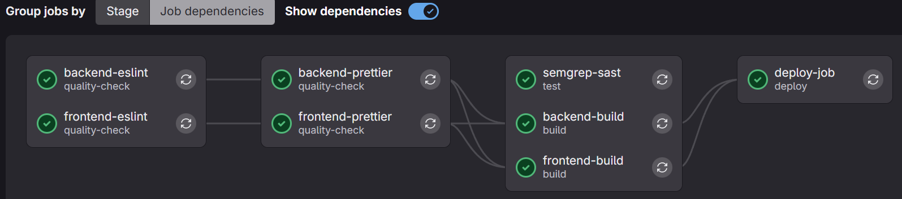

Docker Dontainer
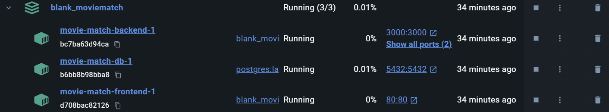

Stoplight (API-Design)

- 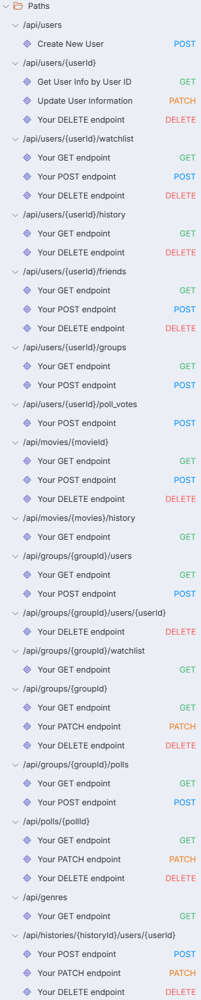

- 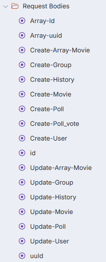
- 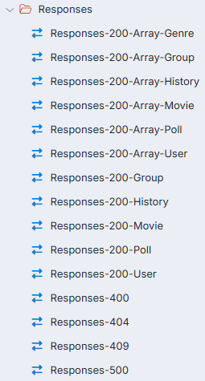

- Models:
  - 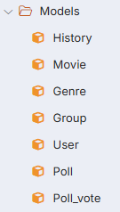
  - Model vom "Poll": 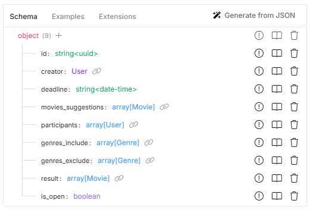

### Screenshots

Feed
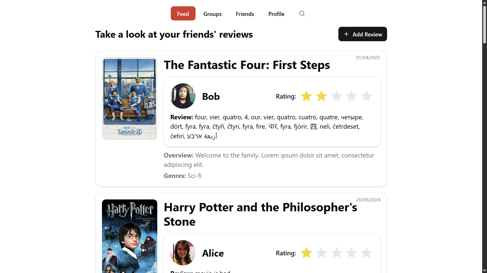

Profiel
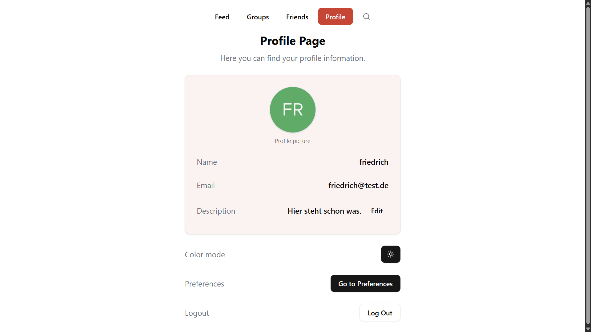

User suchen
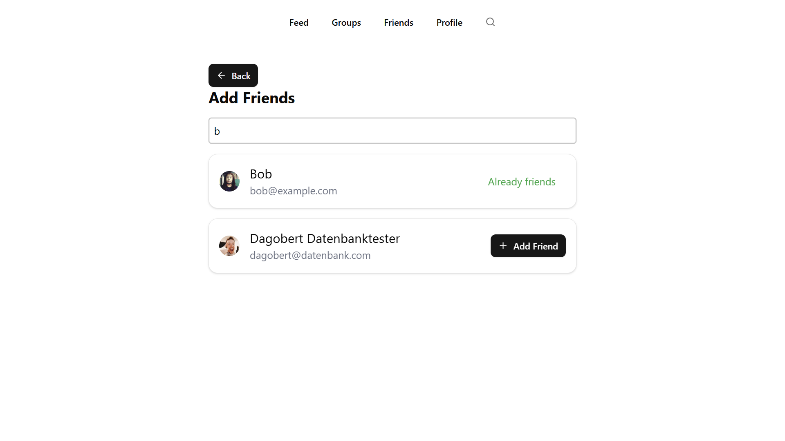

Freunde
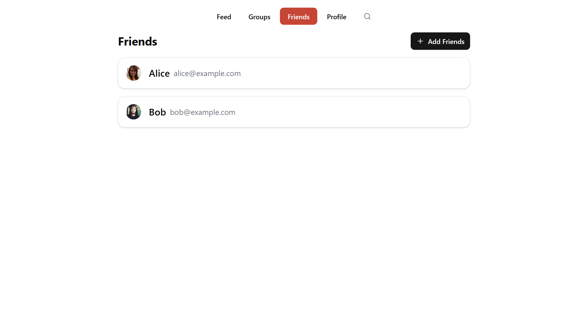

Gruppe erstellen
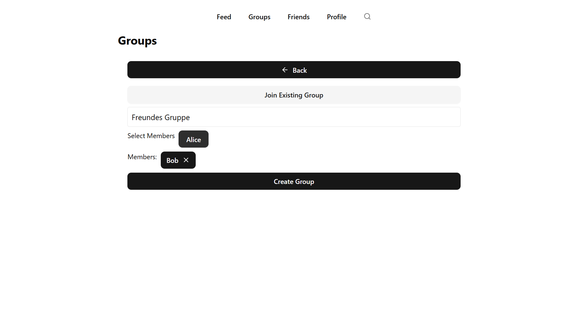

Poll erstellen

1. 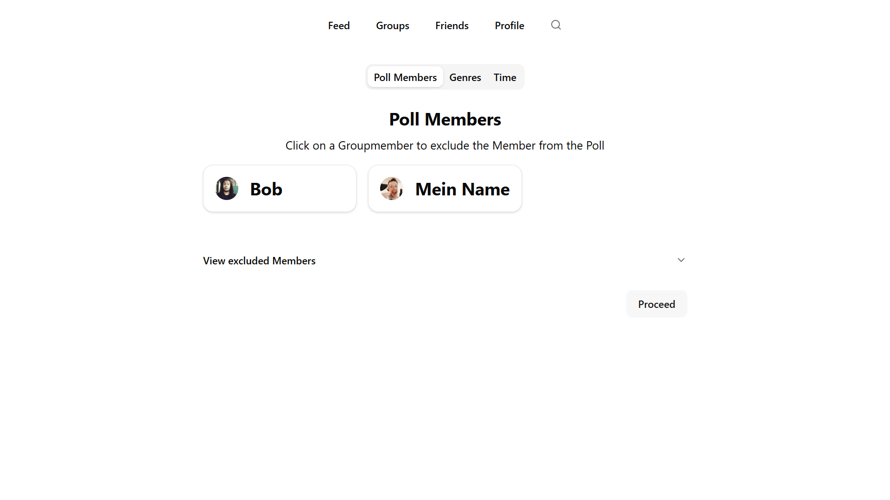
2. 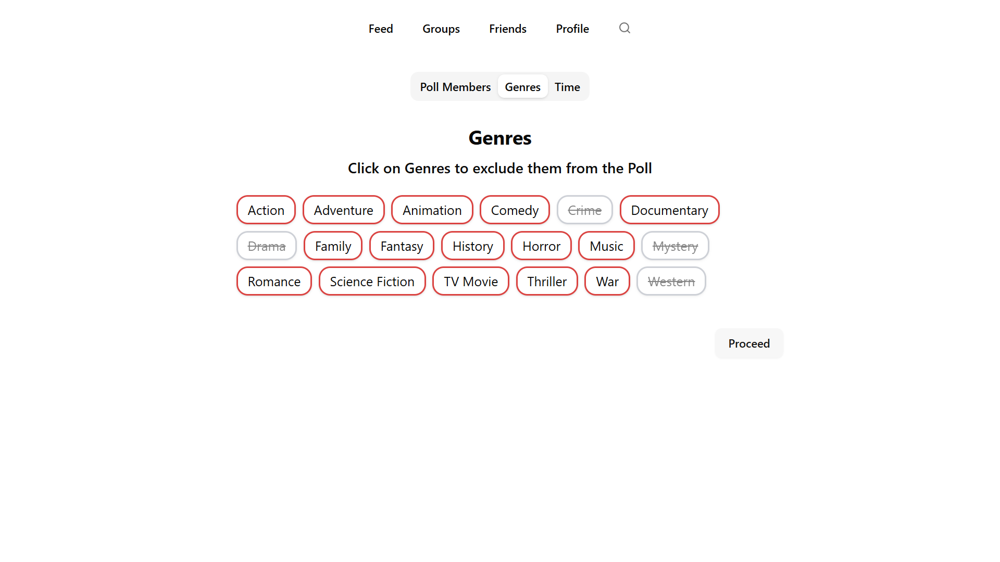
3. 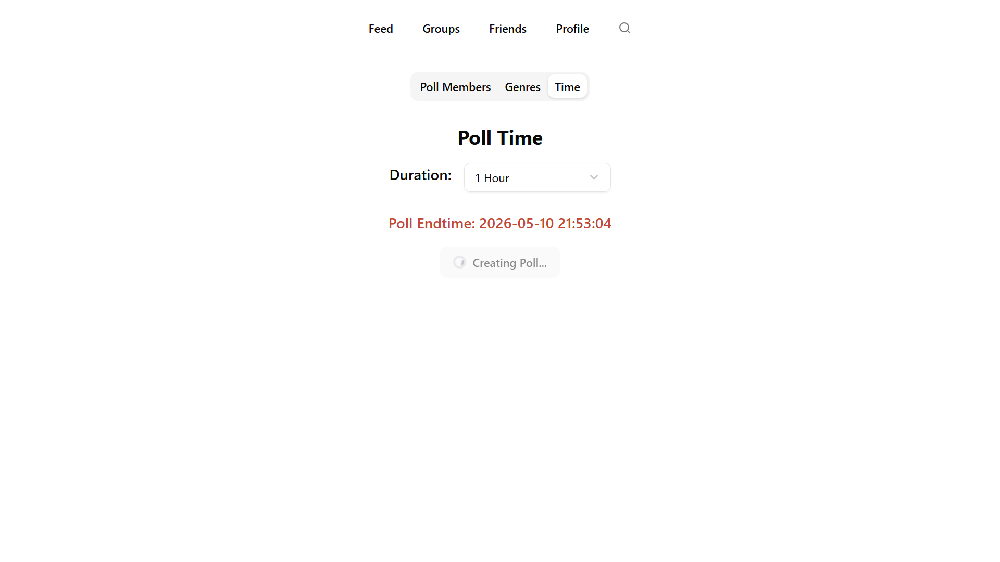
