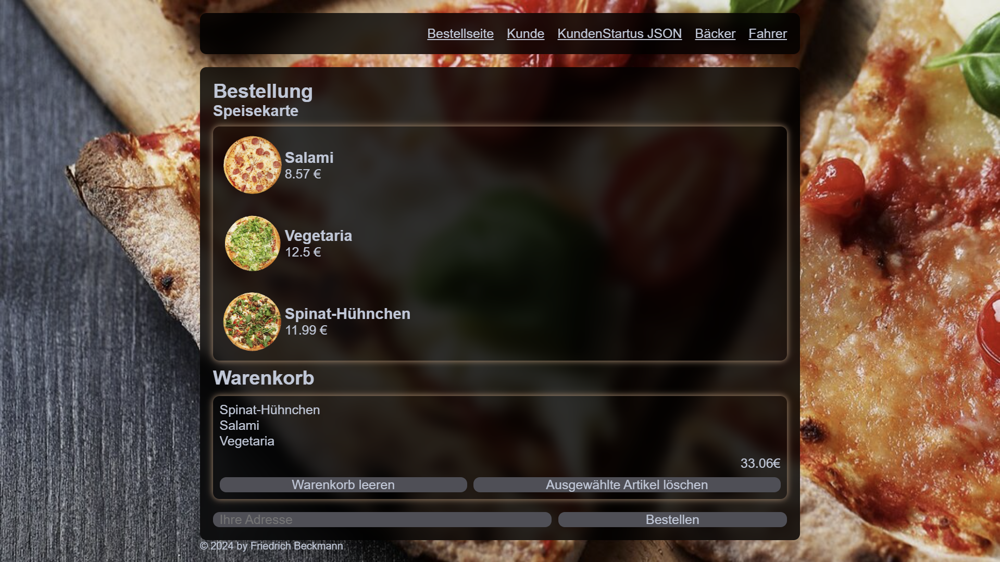
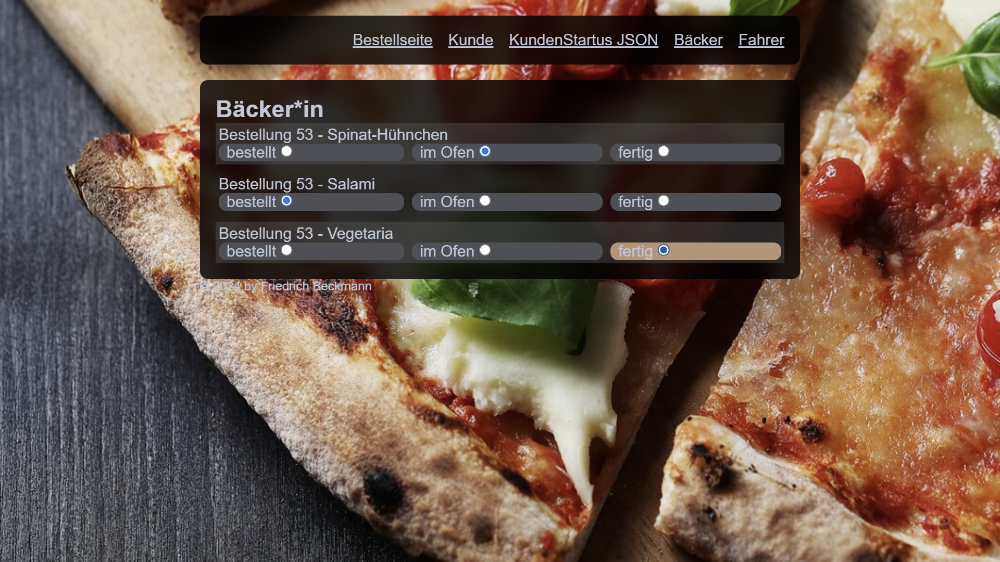
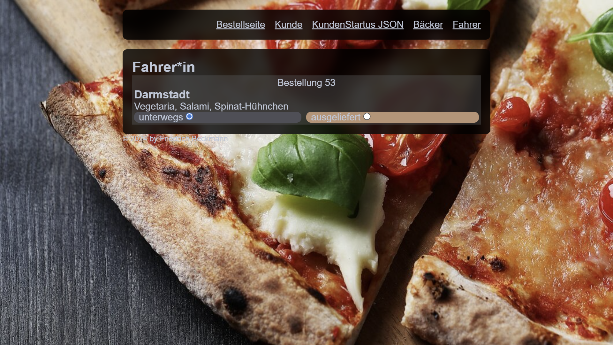
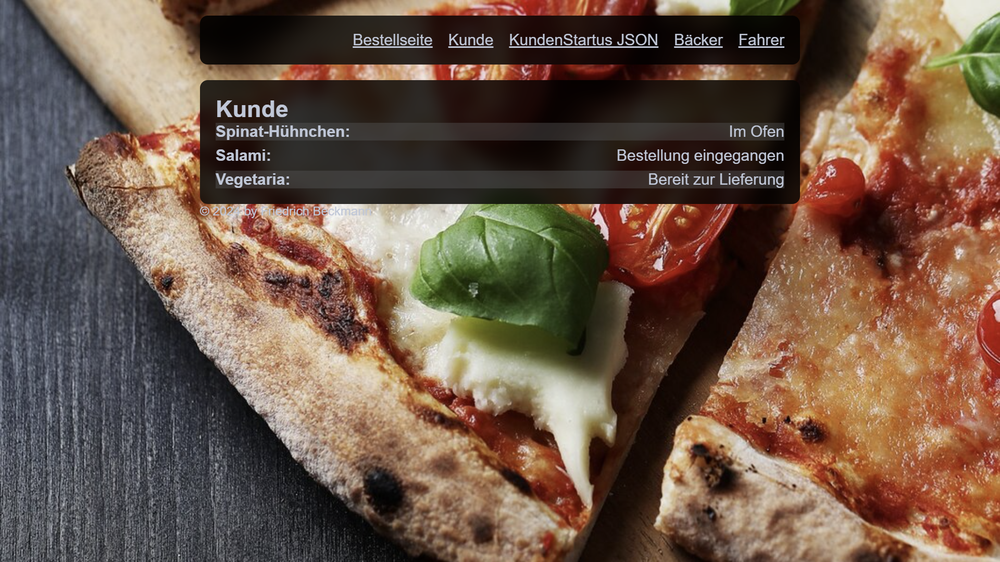

# Pizza Service Web

- <Badge type="info" text="Jahr: 2023 bis 2024" />
  <Badge type="tip" text="Uni" />

Das Projekt Pizza-Service-Web war ein semesterbegleitendes Projekt im Modul „Entwicklung webbasierter Anwendungen“. Im Backend wurde PHP mit einer objektorientierten Vererbungshierarchie eingesetzt. Für die asynchrone Datenübertragung und die Hintergrundaktualisierung wurden JSON-Daten per AJAX übermittelt.

## Technologien

- IDE: PhpStorm
- PHP
- JavaScript / ECMAScript
- AJAX
- MySQL, phpMyAdmin
- (Docker) wurde bereit gestellt
- HTML, CSS

## Screenshots

Bestelleseite

Life Ansicht für den Bäcker

Life Ansicht für den Fahrer

Life Ansicht Kunden. (aktueller Status der Bestellung)

