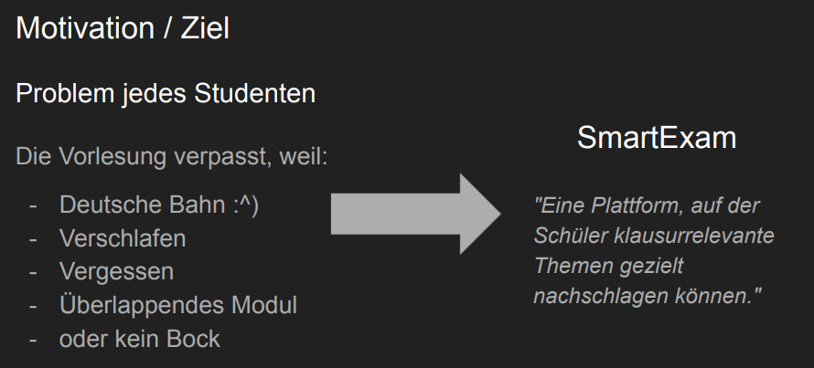
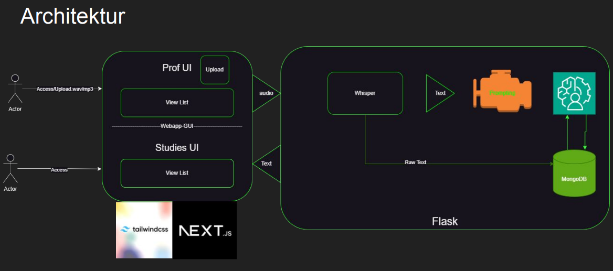
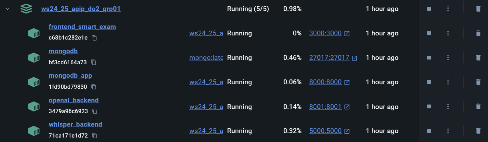
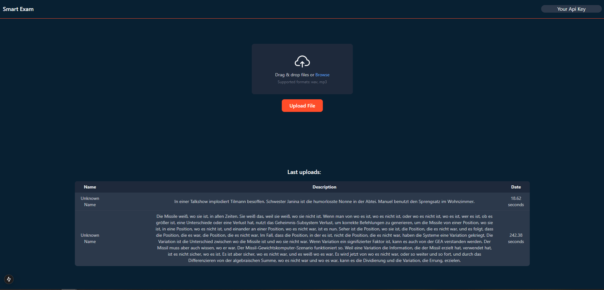
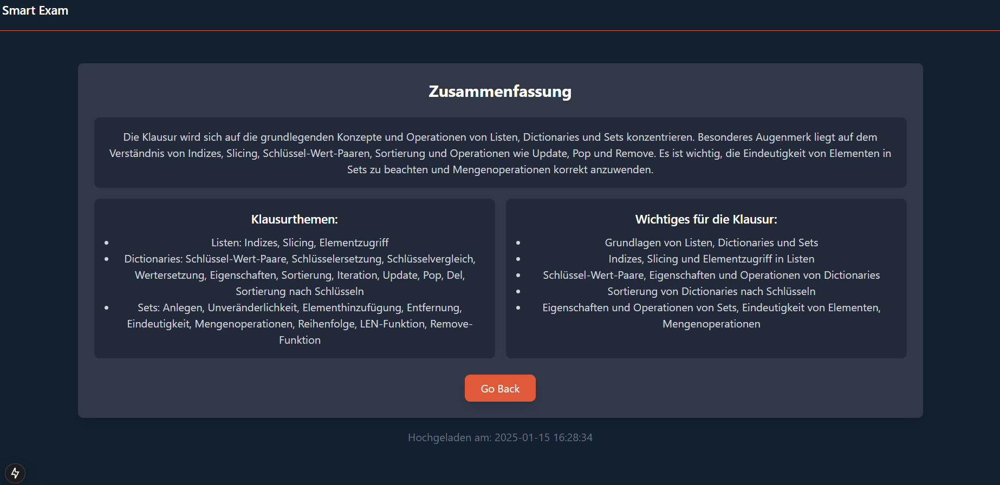

# Smart Exam

- <Badge type="info" text="Jahr: 2024 - 2025" />
  <Badge type="tip" text="Uni" />

::: warning
An diesem Projekt haben mehrere Studierende mitgearbeitet. Es war kein Einzelprojekt.
:::

Smart‑Exam war ein semesterbegleitendes Gruppenprojekt im Modul „Fortgeschrittene Programmierung mit Python“. In dem Projekt entwickelten wir eine Webanwendung, mit der Dozierende Audioaufnahmen ihrer Vorlesungen hochladen können. Im Backend werden die Audiodateien mit Whisper transkribiert. Das Transkript wird mit einem vorgefertigten Prompt an die ChatGPT‑API gesendet; die API-Antwort ist ein JSON, das die wichtigsten Hinweise und Anmerkungen zur anstehenden Klausur zusammenfasst. Dieses Ergebnis wird den Studierenden zur Verfügung gestellt.

Mein Beitrag zum Projekt war die Integration von Whisper und der ChatGPT‑API in das Docker‑gestützte Python‑Backend.

## Technologien

- IDE: PyCharm
- Python
- Whisper (locale transcription)
- ChatGPT API
- MongoDB
- Postman
- Docker
- (tailwindcss, Next.js, React, flask) Wurde größtenteils von Gruppenmitglieder übernommen

## Galerie

Gruppenprojekt Ziel

Architektur

Docker Container

Dozenten Ansicht. Upload der Audiofile und übersicht vergangender transkripte.

Studierende Ansicht für eine Vorlesung.

