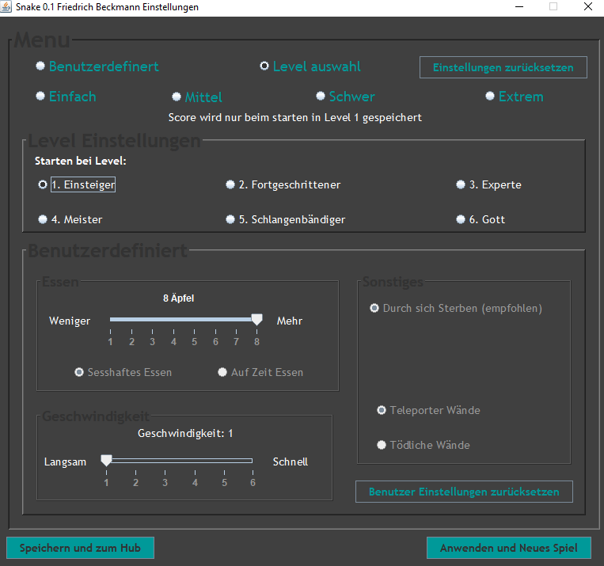
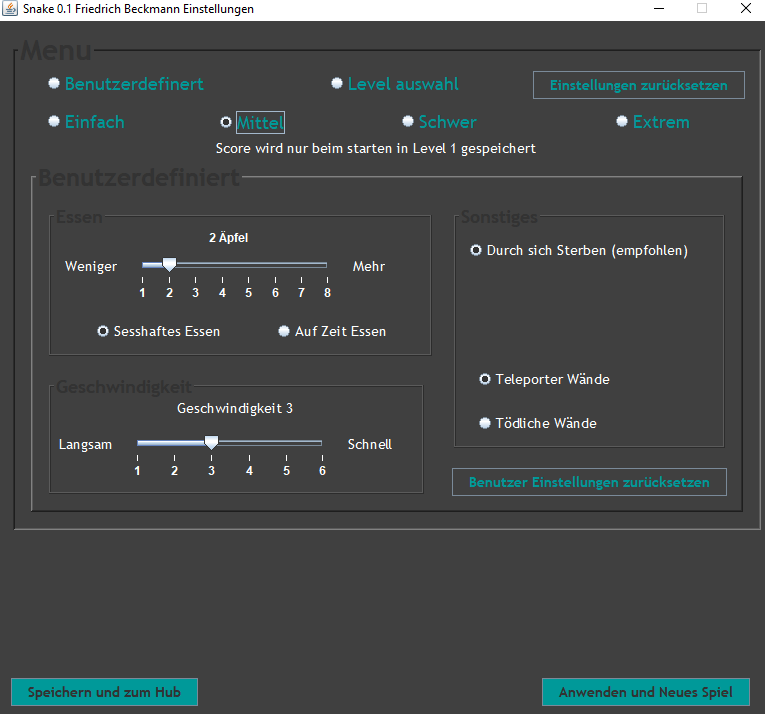
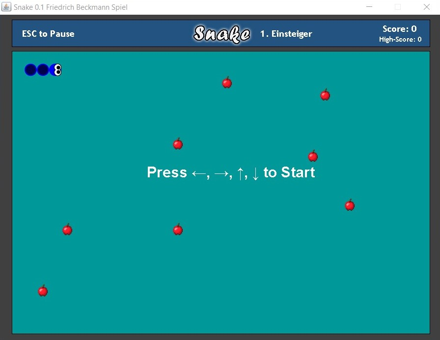
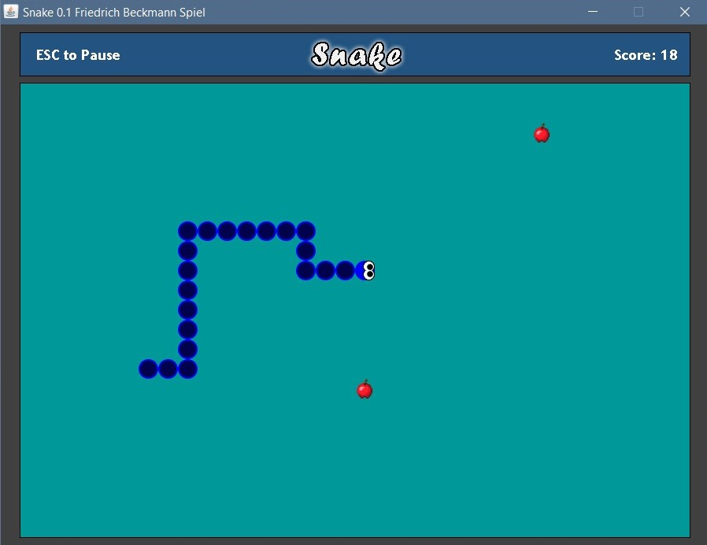
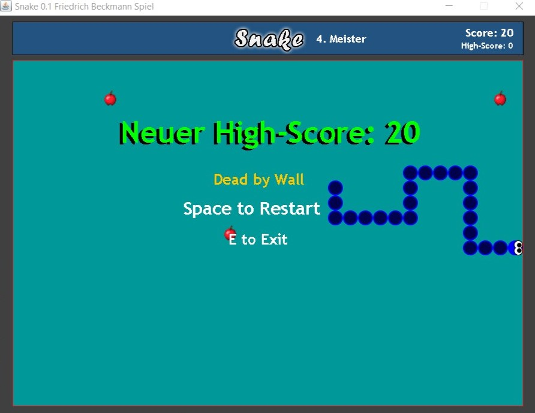

# Snake

- <Badge type="info" text="Jahr: 2018" />
  <Badge type="tip" text="FOS (Schule)" />

Erstes großes Projekt.  
Game Launcher mit Spiel Menü.  
Spiel in eigenem Fenster.

Teil eines Gemeinschaftsprojekt in meiner Fachoberschule in einem Team zu dritt.  
Jeder aus dem Team hat ein eigenes Spiel entwickelt. Welche alle über ein Hub erreichbar waren.

## Technologien

- IDE: NetBeans
- Java

Willst du Snake selber mal spielen? Dann lade dir die .jar herrunter. (Vorraussetzung: Java muss auf deinem Gerät installiert sein)  
<a href="./SnakeFB01.jar" download>Snake.jar herunterladen (97 KB)</a>

## Screenshots

