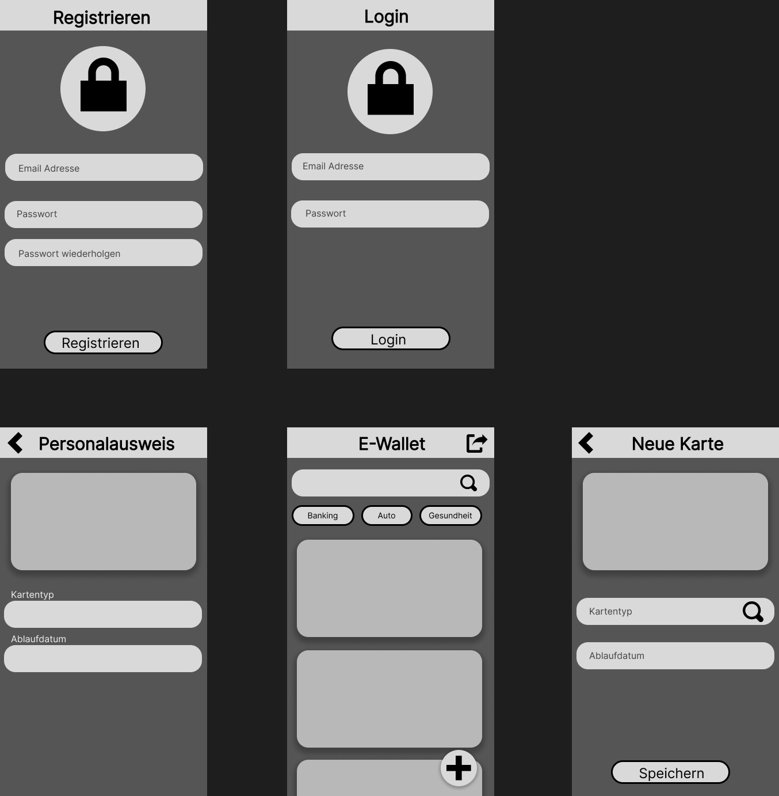
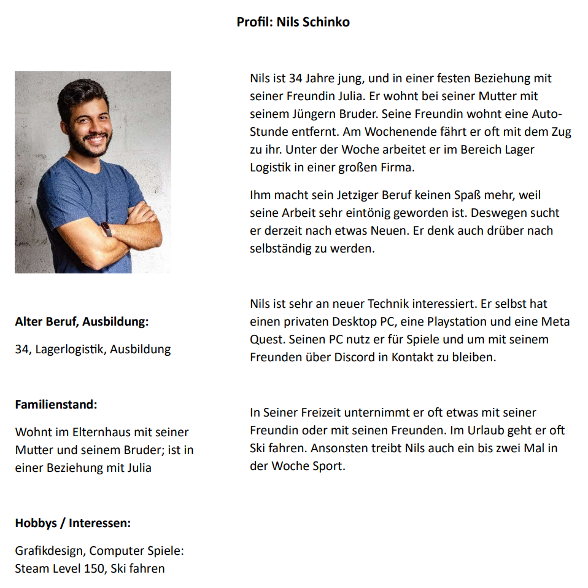

# WalltX App (Uni Gruppen Projekt)

- <Badge type="info" text="Jahr: 2023" />
  <Badge type="tip" text="Uni" />

WalletX ist im Modul HCI (Human Computer Interaction) in einer semesterbegleitenden Gruppenarbeit entstanden. Die Gruppe bestand aus vier Kommilitone, mich eingeschlossen.

Das Projekt begann mit einer Nutzeranalyse, in deren Rahmen wir Papierprototypen erstellten, externe Teilnehmer befragten und Nutzerprofile entwickelten.

## Technologien

- Android Studio
- Java

## Screenshots

Foto Paperprototyp

Digitaler Paperprototype:

Ausgedachter Stereotype / Nutzer der App

### Ausgwählte Screenshots aus der App:

- Registrierung
  
- Home
  
- Einselansicht Personalausweiß
  
